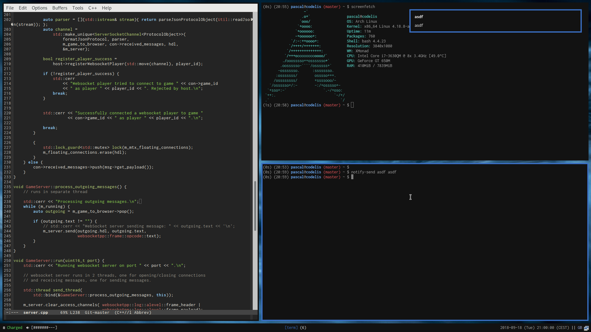
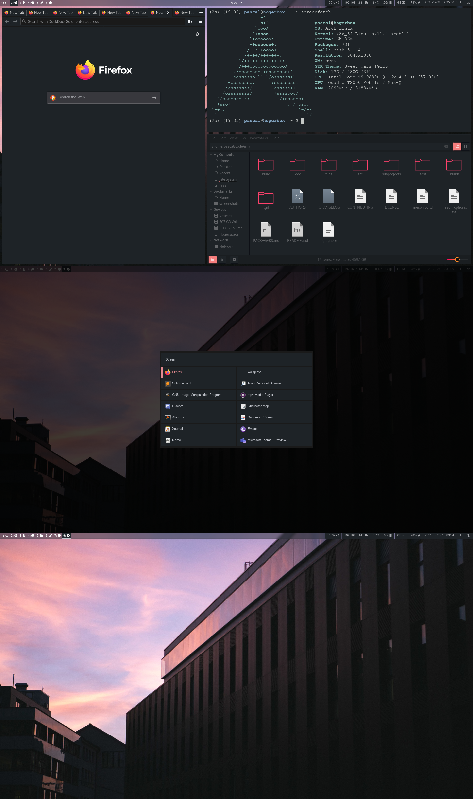

# Dotfiles

There's no real setup instructions, I just mix and match various symlinks to whatever I happen to need at the moment.

First this used to be a XMonad setup:



The cool thing about that was that I could use the monad instance of list to generate my keyboard shortcuts which anyway tend to appear in the form of cartesian products.

After some KDE in between I switched to Sway for just over half a year. This was mostly due to the nice HiDPI support in Wayland which just works out of the box.



Got bored of all the broken electron apps after a while so right now I'm back at KDE.

## Some additional commands
```bash
localectl set-x11-keymap gb,ch,ru logitech_base "" caps:escape,shift:both_capslock,grp:win_space_toggle,grp_led:scroll
```
