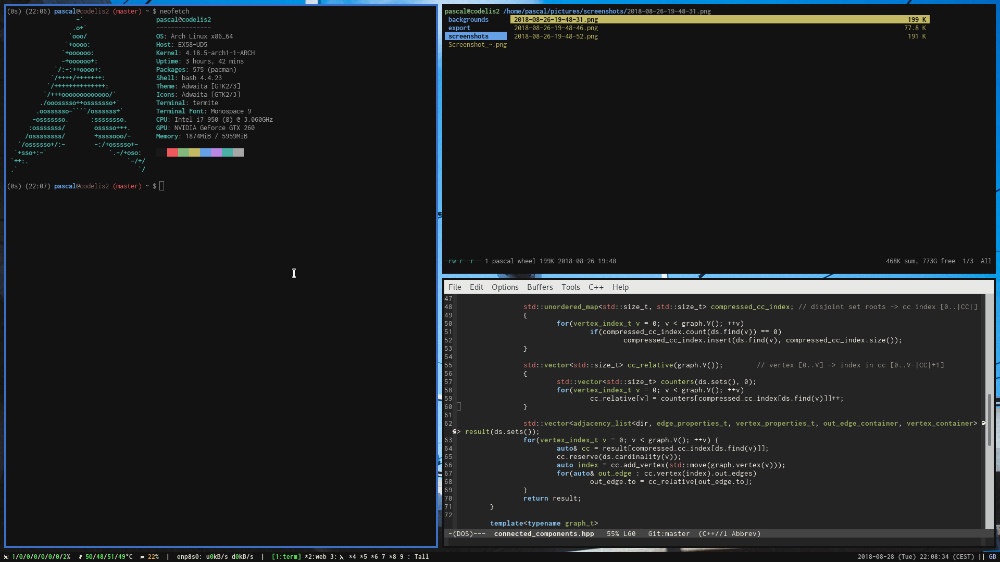

# Dotfiles

Running xmonad with dmenu on Arch Linux




## Some additional commands
```bash
localectl set-x11-keymap gb,ch,ru logitech_base "" caps:escape,shift:both_capslock,grp:win_space_toggle,grp_led:scroll
```
